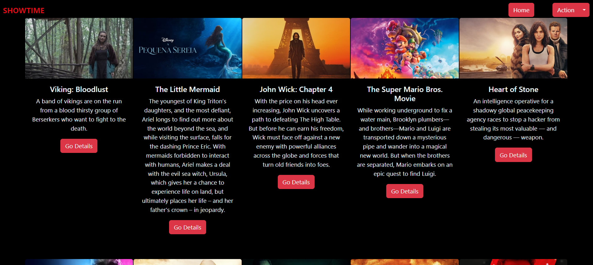
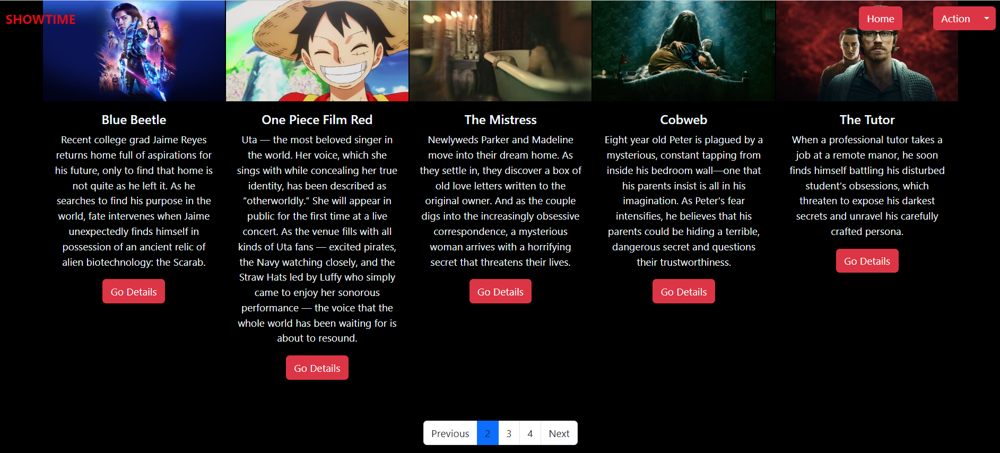
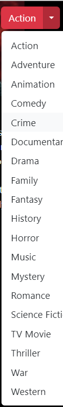

# NETFLIX


- TMDB API was used
- To my list by categories
- Pagination Structure

## Used technologies
The following technologies were used in this project:

- Angular: A JavaScript framework used for web application development.
- TMDb API: API used to retrieve movie information.

## Run on Your Computer

Clone the project

```bash
  git clone https://github.com/elselif/netflixClone.git
```


Install required packages

```bash
  npm install
```

Run the server

```bash
  ng serve
```

  ## Screenshot

  
  
  
